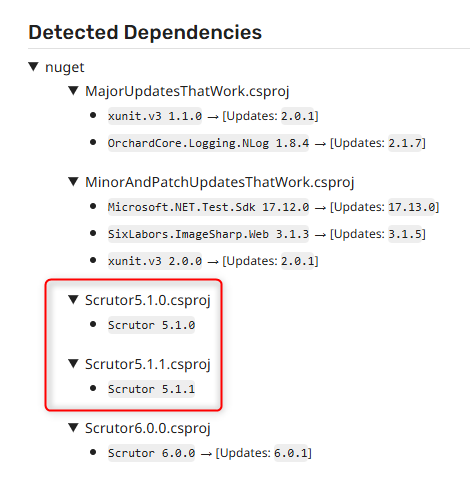

# 35588

Minimal repro for https://github.com/renovatebot/renovate/discussions/35588.

## Current behavior

The Scrutor NuGet package is not updated to its latest 6.0.1 version from 5.1.0 or 5.1.1 (see the corresponding csproj files). Neither is it updated from 5.1.0 to 5.1.1.

The problem in a nutshell:

FYI also including other project files where updates work:

- Minor and patch updates in other packages.
- Major updates in other packages.
- Scrutor 6.0.0 to 6.0.1.

## Expected behavior

Scrutor should be updated to the latest version (6.0.1) from 5.1.0 or 5.1.1.

## Link to the Renovate issue or Discussion

https://github.com/renovatebot/renovate/discussions/35588
